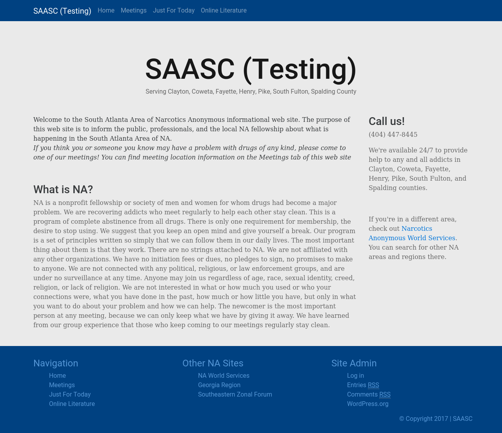

# SAASC-WP-theme
The Wordpress theme for the SAASC Website at http://nasouthatl.com/

# How do I install it on WP
First, download the code...
Second, compress code as a zip file...
Third, upload zip file to WP in themes section...
Lastly, enable the theme in themes section...

# What does this look like?
`(Automaticaly updated each commit)`

